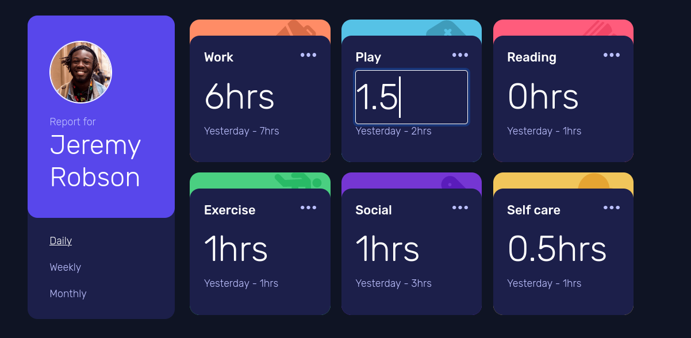

# Frontend Mentor - Time tracking dashboard solution

This is a solution to the [Time tracking dashboard challenge on Frontend Mentor](https://www.frontendmentor.io/challenges/time-tracking-dashboard-UIQ7167Jw). Frontend Mentor challenges help you improve your coding skills by building realistic projects.

## Table of contents

- [Overview](#overview)
  - [The challenge](#the-challenge)
  - [Screenshot](#screenshot)
  - [Links](#links)
- [My process](#my-process)
  - [Built with](#built-with)
  - [What I learned](#what-i-learned)
  - [Continued development](#continued-development)
- [Author](#author)


## Overview

### The challenge

Users should be able to:

- View the optimal layout for the site depending on their device's screen size
- See hover states for all interactive elements on the page
- Switch between viewing Daily, Weekly, and Monthly stats
- Edit the daily, weekly and monthly stats. The changes are kept until the page is refreshed.

### Screenshot



### Links

- Solution URL: [Add solution URL here](https://your-solution-url.com)

## My process

### Built with

- Semantic HTML5 markup
- CSS custom properties
- Sass extension styling
- Bootstrap grid
- Mobile-first workflow
- Javascript DOM manipulation

### What I learned

In order to modify the stats, we need to add and event listener to a class of elements (in this case adding a click evenet to the ellypsis). Within the method, we select the elements we need to hide or show, and we modify the input field to match the corresponding daily, weekly or monthly time.

```js
const edit_hrs = event => {
  console.log("Event");
  /*.elip element*/
  const clickedLink = event.currentTarget;
  const contenedor = clickedLink.offsetParent;
  
  /*Stat label .hrs*/
  const hrs_el = contenedor.querySelector(".hrs");
  
  /*Form to edit the stat*/
  const form = contenedor.querySelector(".send");
  const text_el = form.querySelector(".form-control");
  
  /*Set the input field with the data*/  
  text_el.value = hrs_el.innerHTML.slice(0,-3);

  console.log(hrs_el)

  /*show the input field and hide the label*/
  hrs_el.classList.add("hide");
  form.classList.remove("hide");
}
document.querySelectorAll("img.elip").forEach(a => a.addEventListener("click", edit_hrs));
```
### Continued development

- Adding login and saving the stats in a server.

## Author

- Linkedin - [E. Campos](https://www.linkedin.com/in/edwin-edmar-campos-alarcon/)
- Frontend Mentor - [@Edax97](https://www.frontendmentor.io/profile/Edax97)
